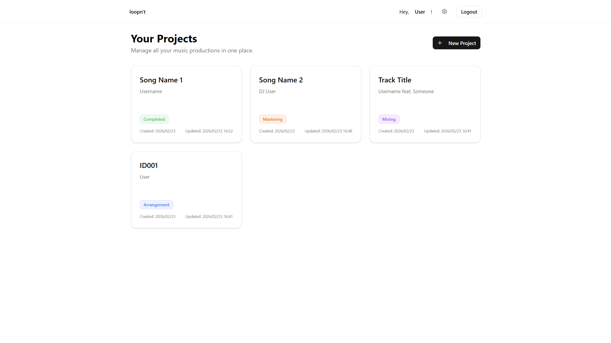
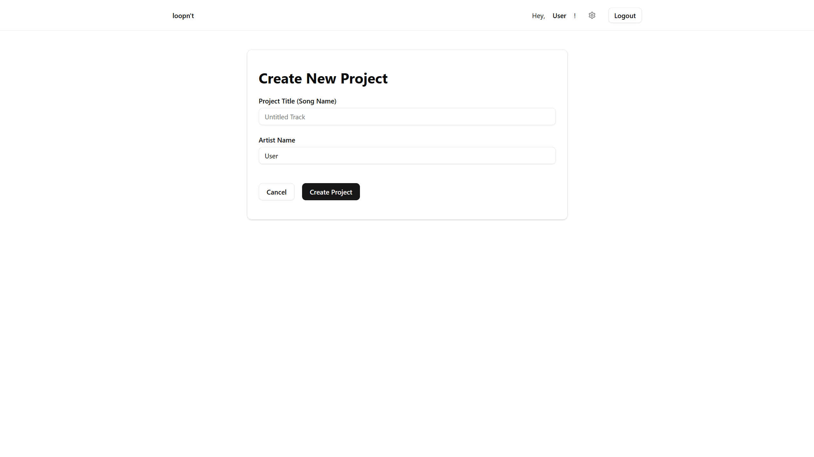
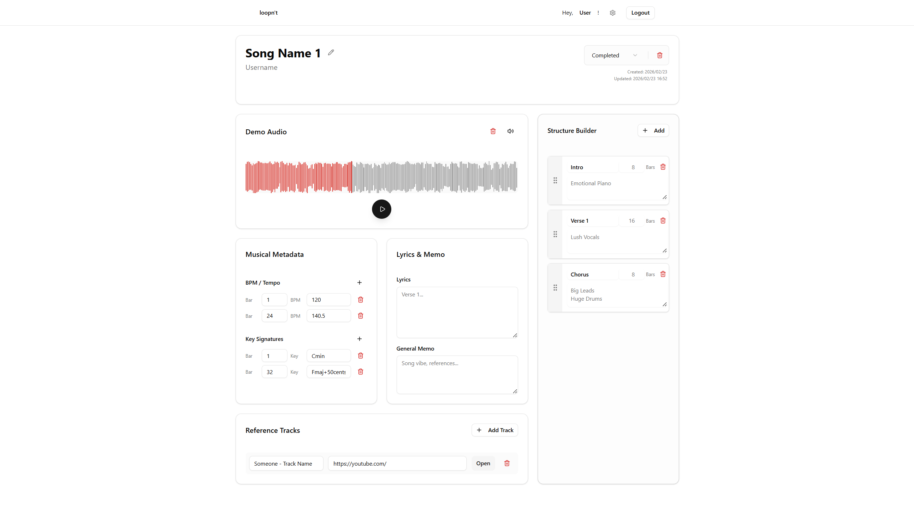
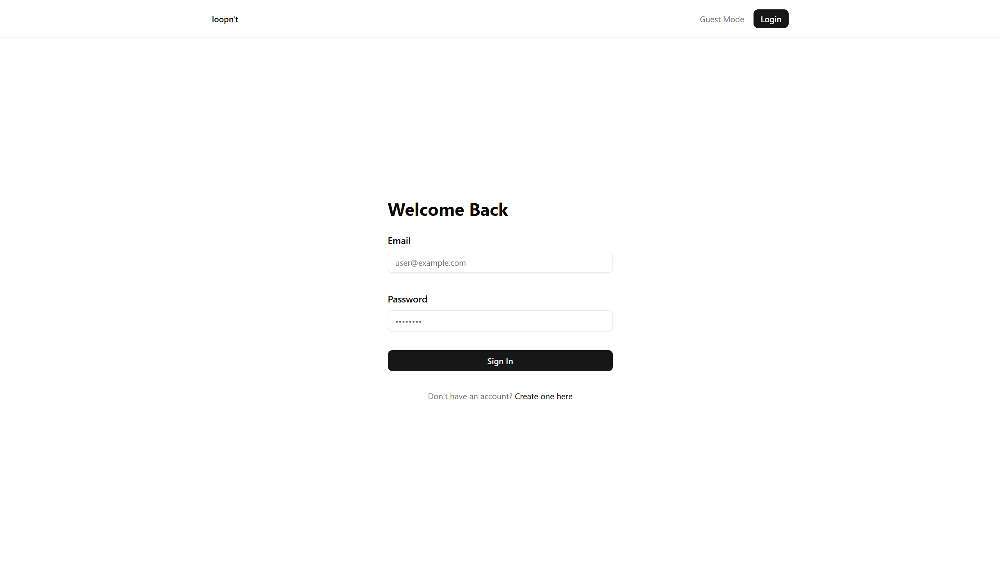
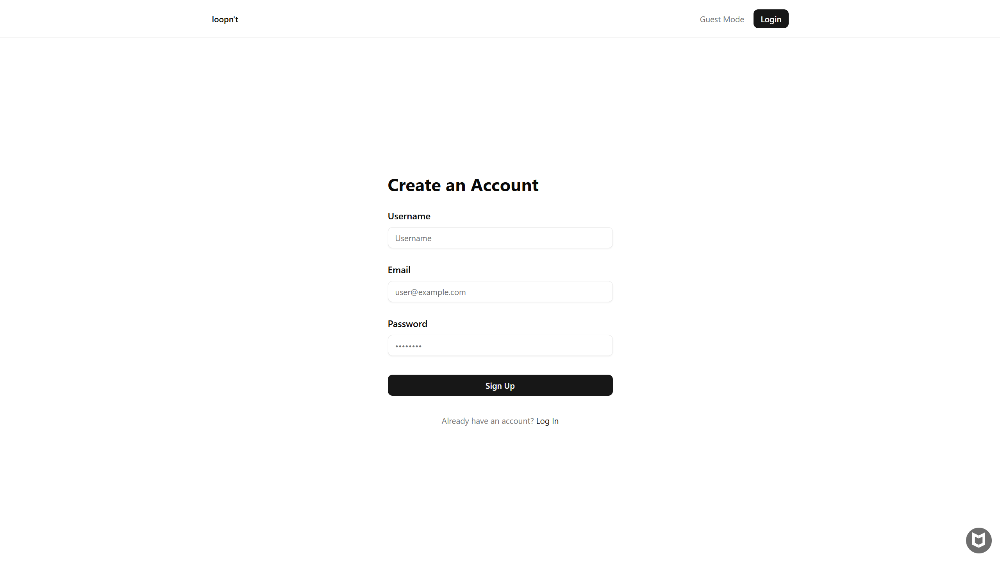

# loopn't

## プロジェクト概要

loopn'tは、音楽クリエイターやプロデューサー向けの楽曲構成・アイデア管理アプリケーションです。「デモ音源を中心としたプロジェクト管理」をコンセプトとし、楽曲の構成要素（BPM、キー、セクション構成、参考曲など）と音源を一元管理できます。

## リンク
- **アプリURL (Vercel)**: https://loopnt.vercel.app/

## なぜ作成したのか
音楽制作では、DAWを開くまでもない細かなアイデアのメモや、バウンスしたデモ音源のバージョン管理、曲の構成案の整理などが煩雑になりがちです。
スマホや外出先のPCからでも、サクッとデモ音源を再生しながら構成を練ったり、思いついた歌詞や音作りをメモできる音楽制作者のための軽量なアプリを作りたいと思い、開発に至りました。

## 画面や機能の説明
- **ダッシュボード**: 自分が作成したプロジェクトを一覧表示します。アレンジ中・完成・ボツなどのステータスごとに整理可能です。
- **ゲストモード対応**: アカウント登録しなくても、ブラウザのローカルストレージにデータを保存して手軽にアプリを試すことができます（ログインするとクラウドに同期・共有可能）。
- **デモ音源プレイヤー**: アップロードした音源の波形を表示・再生できます。
- **Structure Builder（構成ビルダー）**: ドラッグ＆ドロップで直感的に「イントロ」「Aメロ」「サビ」などの楽曲セクションを並び替えて構成を作成できます。小節数やメモもセクション単位で記録可能です。
- **音楽メタデータ管理**: BPM、キー、拍子の変動マップや、制作の参考となるリファレンス楽曲のURLを管理できます。
- **歌詞・メモ機能**: 楽曲全体の方向性や思いついた歌詞を自由に書き留めることができます。

## 使用技術
### フロントエンド
- **フレームワーク**: Next.js 16.1.6 (App Router)
- **言語**: TypeScript
- **スタイリング**: Tailwind CSS
- **UIコンポーネント**: shadcn/ui
- **状態管理**: Zustand
- **主要ライブラリ**: 
  - `wavesurfer.js` (オーディオ波形描画)
  - `@dnd-kit/core` (ドラッグ＆ドロップ用UI)
  - `react-hook-form` + `zod` (フォームバリデーション)
  - `lucide-react` (アイコン)

### バックエンド・インフラ
- **BaaS**: Supabase (PostgreSQL / Auth / Storage)
- **ORM**: Prisma
- **ホスティング**: Vercel

## 開発期間
2026.02.18 ~ 2026.02.23 (約30時間)